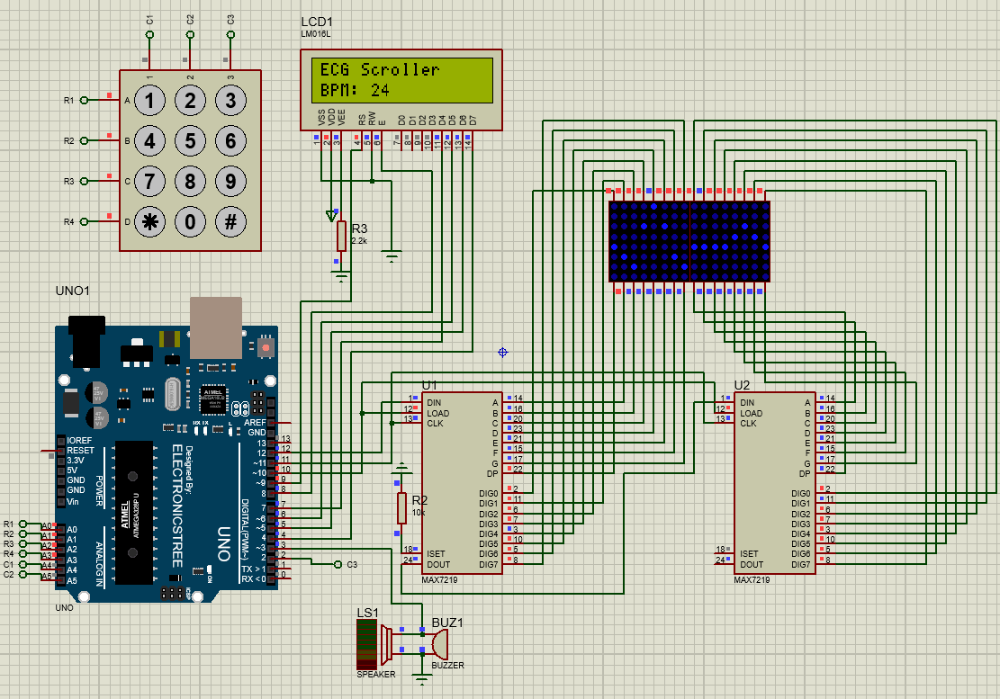

# 🫀 ECG Scroller with LED Matrix, Buzzer, and BPM – Arduino Project

This Arduino-based project simulates a realistic ECG (Electrocardiogram) waveform using LED matrix displays controlled by MAX7219 modules. It includes multiple input and timing configurations using:

- A **Keypad** or **Push Button** for scroll speed control
- Optional **Timer1 Interrupt** for non-blocking updates
- Real-time **BPM display** on a 16x2 LCD
- **Proteus simulations** for both configurations

> This is ideal for biomedical demos, Arduino learners, and embedded systems students.

---

## 📁 File Overview

### 🔌 Arduino Code Variants

| File Name                                | Input Type    | Timer1 Used | Description |
|------------------------------------------|---------------|-------------|-------------|
| `ECG_Scroller_Keypad.ino`                | Keypad        | ❌ No       | Basic keypad control to adjust scroll speed |
| `ECG_scroller_interrupt_keypad.ino`      | Keypad        | ✅ Yes      | Adds non-blocking scroll using hardware timer |
| `ECG_Scroller_Push_button.ino`           | Push Button   | ❌ No       | Uses buttons instead of keypad for speed control |
| `ECG_scroller_push_button_interrupt.ino` | Push Button   | ✅ Yes      | Timer interrupt version for button-controlled scroll |

Each version scrolls an ECG waveform, pulses a buzzer at R-peaks, and calculates heart rate based on the waveform cycle.

---

### 🧪 Proteus Simulations

| File Name                             | Description |
|--------------------------------------|-------------|
| `proteus_schematic_keypad.pdsprj`            | Simulates the keypad-controlled ECG system |
| `proteus_schematic_push_button.pdsprj`        | Simulates the push-button version |

Both include complete wiring for Arduino Uno, 4x MAX7219 LED matrices, LCD, buzzer, and user inputs.

---

## 🚀 Features

- ✅ ECG waveform scrolling across 4 chained 8x8 LED matrices
- ✅ Heartbeat audio on R-peak using a buzzer
- ✅ Scroll speed control via keypad or push buttons
- ✅ Real-time BPM display on I2C 16x2 LCD
- ✅ Debounced input handling
- ✅ Optional Timer1 hardware interrupt for smooth, non-blocking updates
- ✅ Proteus circuit simulation files for both versions

---

## 🔧 Hardware Requirements

- Arduino Uno (or compatible board)  
- 4× MAX7219 8×8 LED matrix modules  
- 4×3 Matrix Keypad **or** Push Buttons  
- 16×2 LCD with I2C backpack  
- Passive Buzzer  
- Jumper Wires & Breadboard  
- PC with Proteus 8.9+ (for simulation)

---

## 📟 Pin Mapping (Default)

| Component       | Arduino Pin     |
|----------------|------------------|
| MAX7219 DIN    | 12               |
| MAX7219 CLK    | 11               |
| MAX7219 CS     | 10               |
| Buzzer         | 9                |
| Keypad Rows    | 2, 3, 4, 5       |
| Keypad Columns | 6, 7, 8, A0      |
| Push Buttons   | 2, 3             |
| LCD I2C        | A4 (SDA), A5 (SCL) |

> Pins may vary per `.ino` file – check the code comments.

---

## ⚙️ Setup Instructions

1. Install the following libraries via Arduino Library Manager:
   - `LedControl` (for MAX7219)
   - `Keypad` (for keypad input)
   - `LiquidCrystal_I2C` (for I2C LCD control)
2. Connect components as per the schematic.
3. Open one of the `.ino` files depending on your hardware setup.
4. Compile and upload to the Arduino Uno.

---

## 🧪 Simulating in Proteus

1. Open either `ECG_Scroller_Keypad.dsn` or `ECG_Scroller_PushButton.dsn` in Proteus 8.9 or later.
2. Double-click the Arduino component and load the compiled `.hex` from Arduino IDE (`Sketch → Export Compiled Binary`).
3. Run the simulation to view LED matrix ECG waveform, use inputs, and observe buzzer and LCD.

---

## 🖼️ Preview

